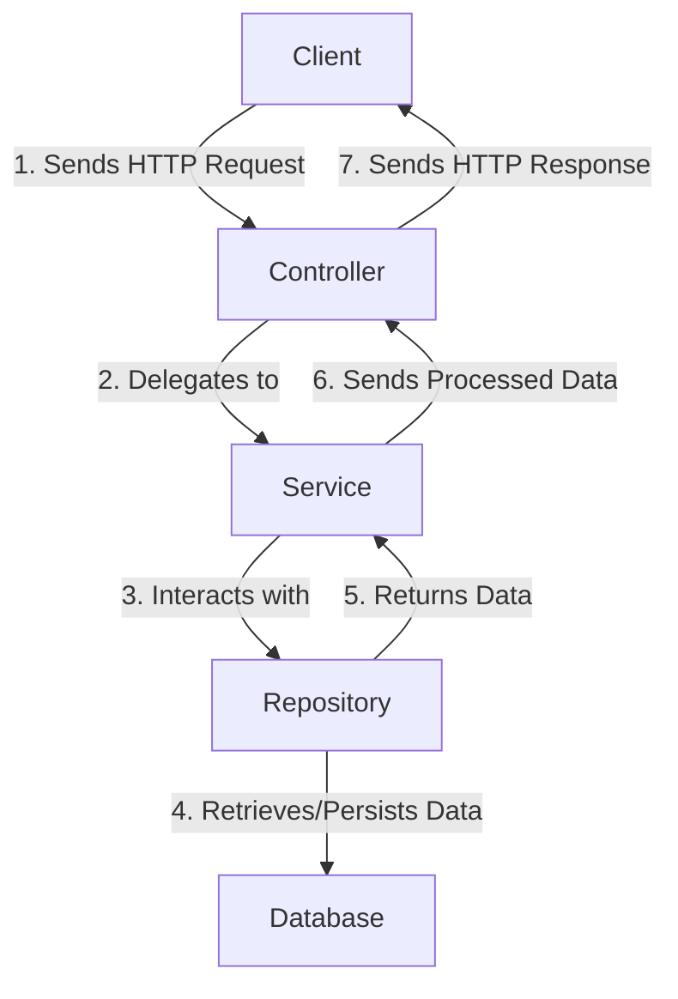

## **Overview**

In a Spring Boot application, the **Controller**, **Service**, and **Repository** are fundamental components of a common three-layered architecture. They play distinct roles in separating the application's responsibilities:

1. **Controller**: Manages HTTP requests and responses.
2. **Service**: Implements business logic and orchestrates interactions.
3. **Repository**: Interacts with the database to perform CRUD operations.

This separation of concerns improves code maintainability, testability, and scalability.

---

## **Controller**

### **Purpose**

- The **Controller** handles incoming HTTP requests, processes input, and sends appropriate responses to the client.
- It is part of the **Presentation Layer** and focuses on **routing** and **data formatting**.

### **Key Characteristics**

1. **Annotation**: Use `@RestController` or `@Controller`.
    - `@RestController`: Combines `@Controller` and `@ResponseBody` for RESTful APIs.
    - `@Controller`: Used for serving web views (e.g., HTML templates).
2. **Mapping**: Defines routes using `@RequestMapping`, `@GetMapping`, `@PostMapping`, etc.
3. **Delegation**: Calls the **Service Layer** to handle business logic.

### **Example**

```java
@RestController 
@RequestMapping("/api/products") 
public class ProductController {

	private final ProductService productService;
	
	public ProductController(ProductService productService) {
	this.productService = productService;     
	}      
	
	@GetMapping     
	public List<Product> getAllProducts() {         
	return productService.getAllProducts();     
	}      
	
	@PostMapping     
	public Product createProduct(@RequestBody Product product) {         
	return productService.createProduct(product);     
	} 
}
```

---

## **Service**

### **Purpose**

- The **Service Layer** implements business logic and acts as a bridge between the **Controller** and **Repository** layers.
- It encapsulates the core operations of the application, ensuring reusable and consistent business rules.

### **Key Characteristics**

1. **Annotation**: Use `@Service`.
2. **Encapsulation**: Contains business logic, data validation, and transformation.
3. **Reusability**: Ensures that business logic can be reused across multiple controllers.

### **Example**

```java
@Service
public class ProductService {

    private final ProductRepository productRepository;

    public ProductService(ProductRepository productRepository) {
        this.productRepository = productRepository;
    }

    public List<Product> getAllProducts() {
        return productRepository.findAll();
    }

    public Product createProduct(Product product) {
        if (product.getPrice() < 0) {
            throw new IllegalArgumentException("Price cannot be negative");
        }
        return productRepository.save(product);
    }
}
```
---

## **Repository**

### **Purpose**

- The **Repository Layer** handles interactions with the database. It is part of the **Data Access Layer**.
- It abstracts database operations, providing a clean interface for performing CRUD operations.

### **Key Characteristics**

1. **Annotation**: Use `@Repository` (optional if extending Spring Data interfaces like `JpaRepository`).
2. **CRUD Operations**: Provides default methods for creating, reading, updating, and deleting records.
3. **Custom Queries**: Supports defining custom queries using query methods or the `@Query` annotation.

### **Example**
```java
@Repository
public interface ProductRepository extends JpaRepository<Product, Long> {
    // Built-in CRUD methods like findAll(), save(), deleteById()

    // Custom query method
    List<Product> findByName(String name);
}

```

---

## **How They Work Together**

### **Flow of Data**

1. **Controller**: Accepts the HTTP request from the client and sends data to the **Service Layer**.
2. **Service**: Processes the data, applies business rules, and communicates with the **Repository**.
3. **Repository**: Interacts with the database, retrieves or persists data, and sends results back to the **Service Layer**.
4. **Service**: Sends processed data back to the **Controller**.
5. **Controller**: Returns the final response to the client.



---

## **Complete Example**

### **Entity Class**
```java
@Entity
public class Product {
    @Id
    @GeneratedValue(strategy = GenerationType.IDENTITY)
    private Long id;

    private String name;
    private double price;

    // Getters and Setters
}
```

### **Repository**
```java
@Repository
public interface ProductRepository extends JpaRepository<Product, Long> {
    List<Product> findByName(String name);
}
```

### **Service**
```java
@Service
public class ProductService {

    private final ProductRepository productRepository;

    public ProductService(ProductRepository productRepository) {
        this.productRepository = productRepository;
    }

    public List<Product> getAllProducts() {
        return productRepository.findAll();
    }

    public Product createProduct(Product product) {
        if (product.getPrice() < 0) {
            throw new IllegalArgumentException("Price cannot be negative");
        }
        return productRepository.save(product);
    }
}
```
### **Controller**
```java
@RestController
@RequestMapping("/api/products")
public class ProductController {

    private final ProductService productService;

    public ProductController(ProductService productService) {
        this.productService = productService;
    }

    @GetMapping
    public List<Product> getAllProducts() {
        return productService.getAllProducts();
    }

    @PostMapping
    public Product createProduct(@RequestBody Product product) {
        return productService.createProduct(product);
    }
}
```

---

## **Key Benefits**

### 1. **Separation of Concerns**

- Each layer has a single, well-defined responsibility:
    - **Controller**: Handles HTTP requests and responses.
    - **Service**: Implements business rules.
    - **Repository**: Manages database interactions.

### 2. **Scalability**

- Adding new features or modifying logic is easier, as each layer operates independently.

### 3. **Testability**

- Individual components can be unit tested:
    - Test the **Controller** with mock services.
    - Test the **Service** with mock repositories.
    - Test the **Repository** against an in-memory database like H2.